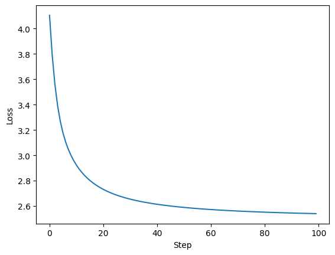
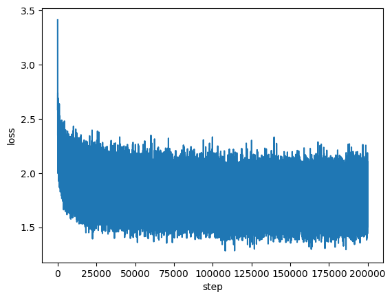
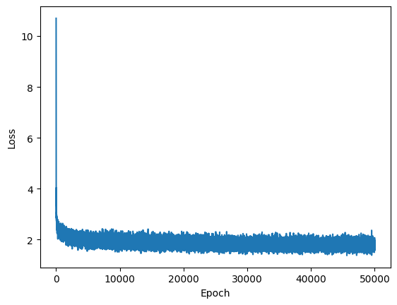
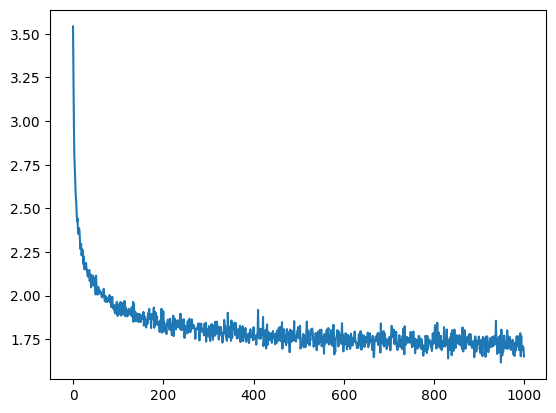

# ChokeSpeare - following [makemore](https://github.com/karpathy/makemore)
Makemore is this interesting video [series](https://www.youtube.com/playlist?list=PLAqhIrjkxbuWI23v9cThsA9GvCAUhRvKZ) by Andrej Karpathy which is imo one of the best practical learning materials out there for NN/DL.

I have attempted to replicate the approach in the context of **poem** generation, exploring similar techniques to create poetic structures and verses.

## Background
1. Used a haiku dataset. Haikus follow a certain rule (5-7-5 syllable pattern). I did not choose to build this constraint into my model. I just let the model learn word coherence (on a character level of ourse) and let it "freestyle".
2. Have followed a semi-bare bones structure.

## Approaches
1. [x] Bigrams
2. [x] Simple NN with optimizations
3. [x] Deep NN
4. [x] Simple RNN as given in [Mikolov et al. 2010](https://www.fit.vut.cz/research/group/speech/public/publi/2010/mikolov_interspeech2010_IS100722.pdf)

## Loss
1. Bigrams
<br/>



Results:
```
'mof tieru arber itost thinot bontikin
t t s by  bf  is lltudske sine e  s lountss me
ceve,usetllitplor n it pesoubug t ts bung  pln tinge y blsthere  y iticogimati jzcere den le  y desyoncthom
vesusie tep.
merrnond o or slichee  pzzwanojutikdd ng hitg t
in
peasievethinoma trofon nomof pl unxxrkeh fqoupe ts tumy sugile hay  ve acachee conthe nd avidorthi's   desithay
tarus furured hismps fu tr itetsheveryhithe n t tt f ithi'ving  t   wing he s diqnere cl
cak ybarer hetand che  y tibo mymere an she n
fe  jnordsh w'qqlis chajs awashenorea gen mbneg'so atjs b,qjud s t
bl gher mzve an powi l a  d
d sticrd bitora matold ancamean to cir aricanspp se nenge ad  s mowveng ndowily ocashxwenioutous  inanete'f cher  icat  s s d  pas huttee ie kes pere is xormbesiorofrghesloxun ksctam'soy te t g tof mest atpe miore owhe,p,sath wqike m d m anteaith
be ctheaconos cedadalicts t ing tispepe shthe  wsword tereee c t kdesckis tamago twindefish  mu'd pin d itay d  pronculilaju ant fereworineriy  p g ce
ifi  gse  mo gs
inca wa ises bold
inon powhas gethe  bmyacr hid inveete bouin sow
```

2. Simple NN.
<br/>



Results:
```
my like afting on all that it sun i go hill toshine wide i smell slicking the but and brang 
love 
ear word is sun sins colds of on in cold 
the eder samer firer's yeged to blanchone poean 
my hair and it of godtinn sumwelling always 
must hundertain therent be vame  drest i smill now a chold breame clashbove griend tone 
sione watch all good grinco nights all chank tiges a move  
a swife the were from the me and exhelpemeding agains  
mome no not ander light bus you was sight leave tring natain  
to blast i cry reflecty blue's no mes hode tosess perfling in hear am heir  was  here 
i ted to your patting rains the mile celiness 
stone nowhy or fricall seekze to word they 
i leave cool a ver the have sucked to bothe red and nevellinessed in home 
easks solflyain a forghour shy fend to your splayresh at up 
the the for again theys of my he won't ther the like morn 
wine woulderf cretempere day in my carreft the soft and close actans has down a p all cly 
prengone forning grave is ands alched and but in unds it bongivence my and manight anxed time 
my stake morever soges spe but string cared be ampile reaf the day you 
```

3. Pretty Deep NN 
```
Layer Sizes (Top to Bottom):
Layer 1: Input Size = 30, Output Size = 128
Layer 2: BatchNorm with Input Size = 128
Layer 3: Input Size = 128, Output Size = 64
Layer 4: BatchNorm with Input Size = 64
Layer 5: Input Size = 64, Output Size = 32
Layer 6: BatchNorm with Input Size = 32
Layer 7: Input Size = 32, Output Size = 30
```




It did achieve a lower result, but I think its fair to assume that some randomness is causing this coincidental drop. This is a classic case of "you don't have enough of a dataset to read any complex feature through deep neural nets."

Here are some predictions anyway.
```
i just yark stor rike 
i girled you star sughly  joy  a spater the will yountinus limpremerubender thicert beuling 
you ander sproilenot race our brain for aled 
i oting will retter 
did your refles mentle you dead 
caugh it's ces 
rack on thesercomy lia and two fellalife grain prine hunge behaos of taste the some lastweek 
potions ignortinging my words the grow i littlessand an you thour words court drura goodles advhs 
i don't so 
what having left the colold memate a sater or me hopespiries ome 
plled so a takener tearting all of gurklobecake midcrill ring loqke severy nearders all on  cold bird my hear sunnalisplitity cond dolen 
i want 
truth orcaled is shodce the to shink palls some throot res botter ange 
a we them check aretfnilly a spristerian 
eyese we beaches just gent sunser  i deatouaint just apped me cound the sated 
i reterself 
onigitreath your summent me lith 
it shim the pose 
ember you glarach ofn a tr hade you dows tlate a slowinto haiku wolly the skies it a for
```


4. RNN



```
shine fasdembing besless will it from no a mish 
the ways stant low songs i heart dealled spring d apker hack in cark becomegess in my be it day no id no me  fall 
many day pop to if your soutles culps the know 
pit foreading  thousids i love peardre my doflest spallf mosh met doot is 
ye ambial out busing lipived i couby orains's criess morant ginds sudding luntlds your one patuet on it's gracks 
aing reaking t in we by 
slesspagger thurriar with licks from flow why was i sot wab here 
gearnenat snowlisidations big bicts  six it 
prock the me man the mo 
little suffer 
```

PS: Ignore the extra spaces in the generated results. It was a preprocessing issue :p
